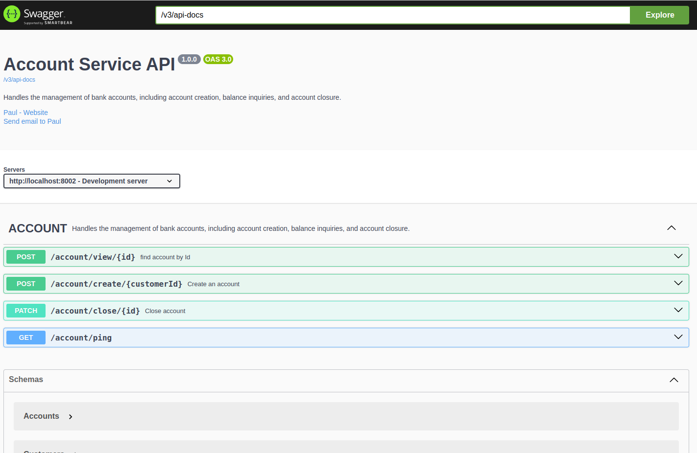

# Account Service

Handles the management of bank accounts, including account creation, balance inquiries, and account closure.

## Pre-requisites

- [**Java 17**](https://www.oracle.com/java/technologies/javase/jdk17-archive-downloads.html)
- [**MySQL**](https://www.mysql.com/downloads/)
- [**Maven**](https://maven.apache.org/download.cgi)
- [**Docker**](https://www.docker.com/)
- [**Docker Compose**](https://docs.docker.com/reference/cli/docker/compose/)

## How to run the project

#### Setting up IDE

```sh
Open the project using IDE of you choice i.e. IntelliJ idea,eclipse, vs, spring tool suite etc.
```

#### Setting up database

You can either use h2 or mysql database by changing the configuration on application.yml

```sh
spring:
  profiles:
    active: h2 or mysql

    For mysql remember to change the database configurations below
    
    `url: jdbc:mysql://127.0.0.1:3306/cards?createDatabaseIfNotExist=true`
    `username: root`
    `password: Baiks@123`
```


#### Run the project

- Run the project using IDE. You expect the code to run successfully. Alternatively you can run the command docker-compose up -d`
## Access the APIs

```sh
To access the APIs, open the link http://localhost:8002/swagger-ui
```


